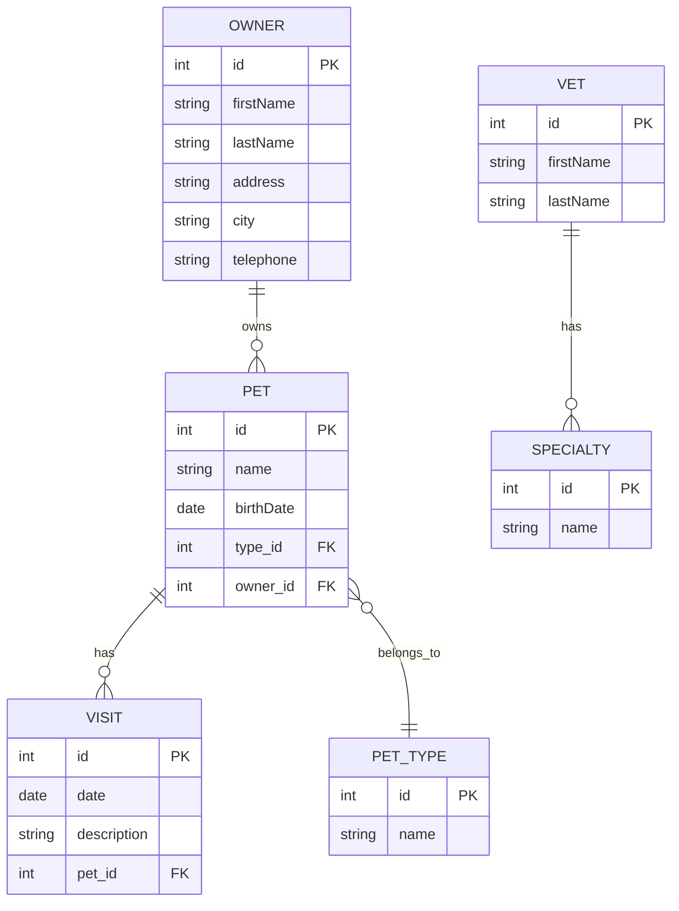

# Spring PetClinic 项目详解

## 📚 项目概述

Spring PetClinic 是 Spring 官方提供的一个经典的示例应用程序，用于展示 Spring Boot 框架的各种特性和最佳实践。这是一个宠物诊所管理系统，模拟了真实的宠物医院业务场景。

### 🎯 项目目标
- 展示 Spring Boot 的核心功能
- 演示现代 Java Web 应用开发的最佳实践
- 提供学习 Spring 生态系统的完整示例
- 作为 Spring 框架新特性的测试平台

## 🏗️ 技术架构

### 核心技术栈
- **Java 17+**: 现代 Java 版本
- **Spring Boot 3.5.0**: 主框架
- **Spring Data JPA**: 数据访问层
- **Spring MVC**: Web 层
- **Thymeleaf**: 模板引擎
- **H2/MySQL/PostgreSQL**: 数据库支持
- **Maven/Gradle**: 构建工具

### 架构模式
项目采用经典的三层架构：
1. **表现层 (Presentation Layer)**: Controller + Thymeleaf 模板
2. **业务层 (Business Layer)**: Service + Entity
3. **数据层 (Data Layer)**: Repository + Database

## 📁 项目结构详解

```
spring-petclinic/
├── src/main/java/org/springframework/samples/petclinic/
│   ├── PetClinicApplication.java          # 主启动类
│   ├── PetClinicRuntimeHints.java        # GraalVM 原生镜像支持
│   ├── model/                            # 基础实体类
│   │   ├── BaseEntity.java              # 基础实体抽象类
│   │   ├── NamedEntity.java             # 命名实体抽象类
│   │   └── Person.java                  # 人员实体抽象类
│   ├── owner/                            # 宠物主人模块
│   │   ├── Owner.java                   # 主人实体
│   │   ├── OwnerController.java         # 主人控制器
│   │   ├── OwnerRepository.java         # 主人数据访问
│   │   ├── Pet.java                     # 宠物实体
│   │   ├── PetController.java           # 宠物控制器
│   │   ├── PetType.java                 # 宠物类型实体
│   │   ├── PetTypeRepository.java       # 宠物类型数据访问
│   │   ├── PetValidator.java            # 宠物验证器
│   │   ├── PetTypeFormatter.java        # 宠物类型格式化器
│   │   └── Visit.java                   # 访问记录实体
│   ├── vet/                             # 兽医模块
│   │   ├── Vet.java                     # 兽医实体
│   │   ├── VetController.java           # 兽医控制器
│   │   ├── VetRepository.java           # 兽医数据访问
│   │   ├── Specialty.java               # 专业领域实体
│   │   └── Vets.java                    # 兽医集合包装类
│   └── system/                          # 系统模块
│       ├── CacheConfiguration.java      # 缓存配置
│       ├── CrashController.java         # 错误处理控制器
│       └── WelcomeController.java       # 欢迎页面控制器
├── src/main/resources/
│   ├── application.properties           # 主配置文件
│   ├── application-mysql.properties     # MySQL 配置
│   ├── application-postgres.properties  # PostgreSQL 配置
│   ├── db/                             # 数据库脚本
│   │   ├── h2/                         # H2 数据库脚本
│   │   ├── mysql/                      # MySQL 数据库脚本
│   │   └── postgres/                   # PostgreSQL 数据库脚本
│   ├── templates/                      # Thymeleaf 模板
│   │   ├── owners/                     # 主人相关页面
│   │   ├── pets/                       # 宠物相关页面
│   │   ├── vets/                       # 兽医相关页面
│   │   └── fragments/                  # 页面片段
│   ├── static/                         # 静态资源
│   └── messages/                       # 国际化消息
├── pom.xml                             # Maven 配置
├── build.gradle                        # Gradle 配置
└── docker-compose.yml                  # Docker 编排配置
```

## 🗄️ 数据模型设计

### 核心实体关系



### 实体类详解

#### 1. BaseEntity (基础实体)
```java
@MappedSuperclass
public class BaseEntity implements Serializable {
    @Id
    @GeneratedValue(strategy = GenerationType.IDENTITY)
    private Integer id;
    
    public boolean isNew() {
        return this.id == null;
    }
}
```
- 所有实体的基类
- 提供统一的 ID 管理
- 使用 JPA 的 `@MappedSuperclass` 注解

#### 2. Owner (宠物主人)
```java
@Entity
@Table(name = "owners")
public class Owner extends Person {
    @NotBlank
    private String address;
    
    @NotBlank
    private String city;
    
    @NotBlank
    @Pattern(regexp = "\\d{10}", message = "{telephone.invalid}")
    private String telephone;
    
    @OneToMany(cascade = CascadeType.ALL, fetch = FetchType.EAGER)
    @JoinColumn(name = "owner_id")
    @OrderBy("name")
    private final List<Pet> pets = new ArrayList<>();
}
```
- 继承自 Person 类
- 使用 Bean Validation 进行数据验证
- 与 Pet 实体建立一对多关系

#### 3. Pet (宠物)
```java
@Entity
@Table(name = "pets")
public class Pet extends NamedEntity {
    @DateTimeFormat(pattern = "yyyy-MM-dd")
    private LocalDate birthDate;
    
    @ManyToOne
    @JoinColumn(name = "type_id")
    private PetType type;
    
    @OneToMany(cascade = CascadeType.ALL, fetch = FetchType.EAGER)
    @JoinColumn(name = "pet_id")
    @OrderBy("date ASC")
    private final Set<Visit> visits = new LinkedHashSet<>();
}
```
- 继承自 NamedEntity
- 与 PetType 建立多对一关系
- 与 Visit 建立一对多关系

#### 4. Vet (兽医)
```java
@Entity
@Table(name = "vets")
public class Vet extends Person {
    @ManyToMany(fetch = FetchType.EAGER)
    @JoinTable(name = "vet_specialties", 
               joinColumns = @JoinColumn(name = "vet_id"),
               inverseJoinColumns = @JoinColumn(name = "specialty_id"))
    private Set<Specialty> specialties;
}
```
- 与 Specialty 建立多对多关系
- 使用 `@JoinTable` 定义中间表

## 🎮 功能模块详解

### 1. 宠物主人管理 (Owner Management)

#### 主要功能
- **查找主人**: 支持按姓氏模糊搜索
- **分页显示**: 大量数据的分页处理
- **添加主人**: 表单验证和数据持久化
- **编辑主人**: 更新主人信息
- **查看详情**: 显示主人及其宠物信息

#### 核心控制器方法
```java
@Controller
class OwnerController {
    
    @GetMapping("/owners")
    public String processFindForm(Owner owner, BindingResult result, Model model) {
        // 处理查找表单
    }
    
    @GetMapping("/owners/{ownerId}")
    public ModelAndView showOwner(@PathVariable("ownerId") int ownerId) {
        // 显示主人详情
    }
    
    @GetMapping("/owners/new")
    public String initCreationForm(Model model) {
        // 初始化创建表单
    }
    
    @PostMapping("/owners/new")
    public String processCreationForm(@Valid Owner owner, BindingResult result) {
        // 处理创建表单
    }
}
```

### 2. 宠物管理 (Pet Management)

#### 主要功能
- **添加宠物**: 为主人添加新宠物
- **编辑宠物**: 修改宠物信息
- **宠物类型**: 管理宠物类型（狗、猫、鸟等）
- **数据验证**: 宠物信息的完整性验证

#### 自定义验证器
```java
@Component
public class PetValidator implements Validator {
    
    @Override
    public void validate(Object obj, Errors errors) {
        Pet pet = (Pet) obj;
        
        if (pet.getName() != null && pet.getName().trim().length() == 0) {
            errors.rejectValue("name", "required", "required");
        }
        
        if (pet.isNew() && pet.getBirthDate() == null) {
            errors.rejectValue("birthDate", "required", "required");
        }
    }
}
```

### 3. 兽医管理 (Veterinarian Management)

#### 主要功能
- **兽医列表**: 显示所有兽医及其专业领域
- **专业领域**: 管理兽医的专业技能
- **JSON API**: 提供 RESTful API 接口

#### REST API 示例
```java
@GetMapping({ "/vets" })
public @ResponseBody Vets showResourcesVetList() {
    Vets vets = new Vets();
    vets.getVetList().addAll(this.vetRepository.findAll());
    return vets;
}
```

### 4. 访问记录管理 (Visit Management)

#### 主要功能
- **添加访问**: 记录宠物的医疗访问
- **访问历史**: 查看宠物的历史访问记录
- **日期管理**: 访问日期的格式化处理

## 🔧 技术特性详解

### 1. Spring Boot 自动配置

#### 主启动类
```java
@SpringBootApplication
@ImportRuntimeHints(PetClinicRuntimeHints.class)
public class PetClinicApplication {
    public static void main(String[] args) {
        SpringApplication.run(PetClinicApplication.class, args);
    }
}
```

#### 关键注解说明
- `@SpringBootApplication`: 组合注解，包含：
  - `@Configuration`: 配置类
  - `@EnableAutoConfiguration`: 启用自动配置
  - `@ComponentScan`: 组件扫描
- `@ImportRuntimeHints`: GraalVM 原生镜像支持

### 2. 数据访问层 (Spring Data JPA)

#### Repository 接口
```java
public interface OwnerRepository extends Repository<Owner, Integer> {
    
    @Query("SELECT DISTINCT owner FROM Owner owner left join fetch owner.pets WHERE owner.lastName LIKE :lastName%")
    @Transactional(readOnly = true)
    Collection<Owner> findByLastName(@Param("lastName") String lastName);
    
    @Query("SELECT owner FROM Owner owner left join fetch owner.pets WHERE owner.id =:id")
    @Transactional(readOnly = true)
    Owner findById(@Param("id") Integer id);
    
    void save(Owner owner);
    
    Collection<Owner> findByLastName(String lastName);
}
```

#### 特性说明
- **方法查询**: 根据方法名自动生成查询
- **@Query 注解**: 自定义 JPQL 查询
- **分页支持**: 使用 `Pageable` 接口
- **事务管理**: `@Transactional` 注解

### 3. Web 层 (Spring MVC)

#### 控制器特性
- **RESTful 设计**: 遵循 REST 原则
- **数据绑定**: 自动绑定请求参数
- **验证支持**: Bean Validation 集成
- **异常处理**: 全局异常处理机制

#### 数据绑定示例
```java
@InitBinder
public void setAllowedFields(WebDataBinder dataBinder) {
    dataBinder.setDisallowedFields("id");
}
```

### 4. 模板引擎 (Thymeleaf)

#### 模板特性
- **自然模板**: HTML 友好的模板语法
- **片段复用**: 使用 `th:fragment` 定义可复用片段
- **国际化**: 支持多语言
- **表单绑定**: 与 Spring MVC 无缝集成

#### 模板示例
```html
<!DOCTYPE html>
<html xmlns:th="http://www.thymeleaf.org">
<head>
    <title th:text="#{welcome}">Welcome</title>
</head>
<body>
    <div th:fragment="header">
        <h1 th:text="#{welcome}">Welcome</h1>
    </div>
</body>
</html>
```

### 5. 缓存机制

#### 缓存配置
```java
@Configuration
@EnableCaching
public class CacheConfiguration {
    
    @Bean
    public CacheManager cacheManager() {
        CaffeineCacheManager cacheManager = new CaffeineCacheManager("vets");
        cacheManager.setCaffeine(Caffeine.newBuilder()
            .maximumSize(100)
            .expireAfterWrite(10, TimeUnit.MINUTES));
        return cacheManager;
    }
}
```

#### 缓存使用
```java
@Cacheable("vets")
public Collection<Vet> findAll() {
    return vetRepository.findAll();
}
```

### 6. 数据库支持

#### 多数据库配置
项目支持三种数据库：

1. **H2 (默认)**: 内存数据库，适合开发和测试
2. **MySQL**: 生产环境常用数据库
3. **PostgreSQL**: 开源企业级数据库

#### 配置文件示例
```properties
# application.properties (H2)
database=h2
spring.sql.init.schema-locations=classpath*:db/${database}/schema.sql
spring.sql.init.data-locations=classpath*:db/${database}/data.sql

# application-mysql.properties
spring.datasource.url=jdbc:mysql://localhost:3306/petclinic
spring.datasource.username=petclinic
spring.datasource.password=petclinic
spring.jpa.database-platform=org.hibernate.dialect.MySQLDialect
```

### 7. 测试支持

#### 测试配置
- **TestContainers**: 集成测试中的数据库容器
- **Spring Boot Test**: 完整的应用上下文测试
- **MockMvc**: Web 层测试

#### 测试示例
```java
@SpringBootTest(webEnvironment = SpringBootTest.WebEnvironment.RANDOM_PORT)
@Testcontainers
class PetClinicIntegrationTests {
    
    @Container
    static MySQLContainer<?> mysql = new MySQLContainer<>("mysql:9.2")
            .withDatabaseName("petclinic")
            .withUsername("petclinic")
            .withPassword("petclinic");
}
```

## 🚀 运行和部署

### 1. 本地运行

#### 使用 Maven
```bash
# 克隆项目
git clone https://github.com/spring-projects/spring-petclinic.git
cd spring-petclinic

# 编译和运行
./mvnw package
java -jar target/*.jar

# 或者直接运行
./mvnw spring-boot:run
```

#### 使用 Gradle
```bash
# 编译
./gradlew build

# 运行
./gradlew bootRun
```

### 2. Docker 部署

#### 构建镜像
```bash
./mvnw spring-boot:build-image
```

#### Docker Compose
```bash
# 启动 MySQL
docker compose up mysql

# 启动 PostgreSQL
docker compose up postgres
```

### 3. 访问应用
- **主页**: http://localhost:8080
- **H2 控制台**: http://localhost:8080/h2-console
- **Actuator**: http://localhost:8080/actuator

## 📊 项目亮点

### 1. 最佳实践展示
- **分层架构**: 清晰的分层设计
- **依赖注入**: Spring IoC 容器使用
- **配置管理**: 多环境配置支持
- **异常处理**: 统一的异常处理机制

### 2. 现代 Java 特性
- **Java 17**: 使用最新 LTS 版本
- **Lambda 表达式**: 函数式编程
- **Stream API**: 集合操作优化
- **Optional**: 空值安全处理

### 3. Spring 生态集成
- **Spring Boot**: 快速应用开发
- **Spring Data JPA**: 数据访问简化
- **Spring MVC**: Web 应用框架
- **Spring Cache**: 缓存抽象

### 4. 开发工具支持
- **DevTools**: 热重载支持
- **Actuator**: 应用监控
- **Checkstyle**: 代码规范检查
- **JaCoCo**: 代码覆盖率

## 🎓 学习价值

### 1. Spring Boot 入门
- 了解 Spring Boot 的核心概念
- 学习自动配置机制
- 掌握 Starter 依赖使用

### 2. Web 应用开发
- MVC 模式实践
- RESTful API 设计
- 表单处理和验证

### 3. 数据访问技术
- JPA/Hibernate 使用
- Repository 模式
- 数据库事务管理

### 4. 企业级特性
- 缓存机制
- 监控和健康检查
- 多环境配置
- 容器化部署

## 🔍 扩展建议

### 1. 功能扩展
- 添加用户认证和授权
- 实现宠物预约系统
- 集成支付功能
- 添加消息通知

### 2. 技术升级
- 集成 Spring Security
- 添加 API 文档 (Swagger)
- 实现微服务架构
- 集成消息队列

### 3. 性能优化
- 数据库连接池优化
- 缓存策略优化
- 静态资源 CDN
- 数据库索引优化

## 📝 总结

Spring PetClinic 是一个优秀的 Spring Boot 学习项目，它：

1. **完整性**: 涵盖了 Web 应用开发的各个方面
2. **实用性**: 模拟真实的业务场景
3. **现代性**: 使用最新的技术栈和最佳实践
4. **可扩展性**: 为后续功能扩展提供了良好的基础

通过学习和实践这个项目，开发者可以：
- 快速掌握 Spring Boot 开发
- 理解企业级应用架构
- 学习现代 Java Web 开发技术
- 为实际项目开发积累经验

这个项目不仅是 Spring 框架的官方示例，更是现代 Java Web 应用开发的标杆项目，值得每个 Java 开发者深入学习和研究。

---

*本文档基于 Spring PetClinic 3.5.0-SNAPSHOT 版本编写，涵盖了项目的核心特性和技术要点。建议结合实际代码进行学习，以获得最佳的学习效果。*
